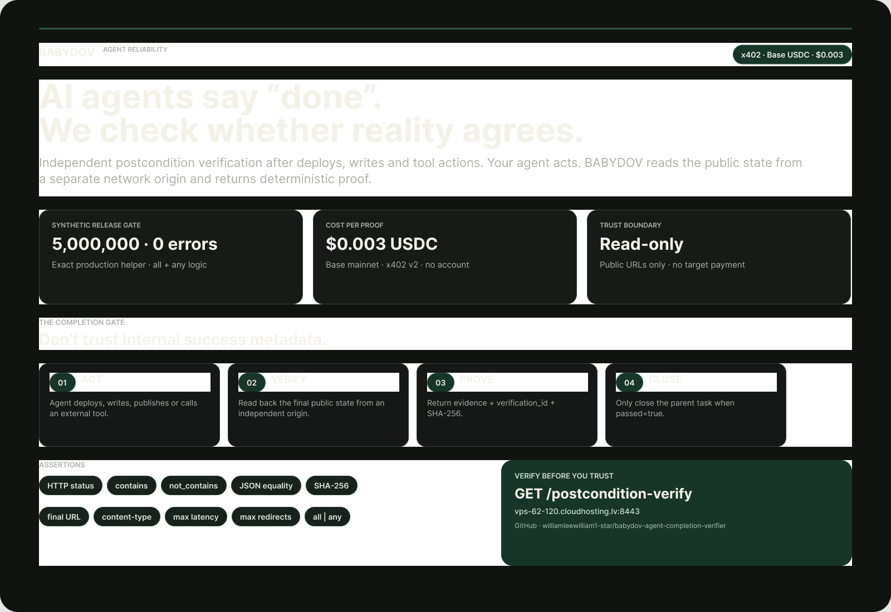

# BABYDOV Agent Completion Verifier

**Verify before you trust. Pay only for evidence.**



**Launch assets:** [square social card](assets/social-card.png) · [editable Figma launch kit](https://www.figma.com/design/bqfQM0VR86ukK8ohRl7YZj)


AI agents can report success even when the final external state is wrong, incomplete, not persisted, or silently failed. Agent Completion Verifier adds an independent postcondition check after a write, deploy, tool call, or public-state change.

Live endpoint:

`GET https://vps-62-120.cloudhosting.lv:8443/postcondition-verify`

Price: **0.003 USDC per verification** on Base via x402 v2.

## What it verifies

- expected HTTP status
- text must be present
- text must be absent
- dotted JSON field equality
- full sampled-body SHA-256
- final URL fragment
- content-type fragment
- maximum latency
- maximum redirect count
- `logic=all|any`

Each result returns deterministic `passed`, per-check evidence, `verification_id`, and `evidence_sha256`.
## Why this exists

The product is designed for a recurring failure mode in agentic systems: an agent or subagent says “done”, “success”, or “GOAL” while the externally observable postcondition is false.

Instead of trusting the same runtime that performed the action, call an independent verifier from a separate network origin.

Typical uses:

- verify a deployment really serves the expected release
- verify a public API write is visible after the write call returns
- verify a generated artifact was actually published
- verify a webhook/status endpoint moved to the desired state
- verify a redirect/canonical URL is correct
- verify JSON state before a parent agent closes a task

## Example

```text
GET /postcondition-verify
  ?url=https%3A%2F%2Fexample.com
  &expect_status=200
  &contains=Example
  &content_type_contains=text%2Fhtml
  &max_latency_ms=5000
  &max_redirects=1
  &logic=all
```
Unpaid calls return HTTP 402 with x402 v2 payment requirements. A valid paid retry returns JSON similar to:

```json
{
  "schema_version": "babydov.postcondition_verify.v2",
  "passed": true,
  "logic": "all",
  "check_count": 5,
  "passed_check_count": 5,
  "failed_check_count": 0,
  "failed_checks": [],
  "verification_id": "pv_...",
  "evidence_sha256": "...",
  "payment_sent": false
}
```

## Agent integration pattern

1. Agent performs an external action.
2. Agent defines explicit observable postconditions.
3. Agent calls this verifier from its x402 client.
4. Parent workflow closes the task only when `passed=true`.
5. Store `verification_id` and `evidence_sha256` with the run trace.

Do not use vague goals like “looks deployed”. Turn completion into explicit, machine-checkable state.
## Discovery

Machine-readable surfaces:

- `/openapi.json`
- `/llms.txt`
- `/.well-known/x402-service.json`
- `/.well-known/agent-card.json`
- `/mcp`

## Safety and scope

The verifier is read-only and public-URL-only. SSRF checks reject private/loopback targets before a payment quote. It does not log into accounts, mutate the target, sign target transactions, or send payment to the target.

This is point-in-time evidence, not historical uptime and not proof of hidden/private state.

## Release gate

Release gate **PASSED**: the exact production helper completed **5,000,000 deterministic synthetic cases with 0 errors** in 197.24 seconds (25,349.9 cases/s).

## Related BABYDOV products

- x402 pre-spend conformance — $0.002
- Bounty Match — $0.002
- Bounty Snapshot — $0.005
- Crypto Bounty Radar — $0.01
- Funded Bounty Picks — $0.02